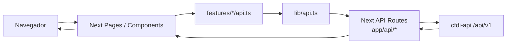
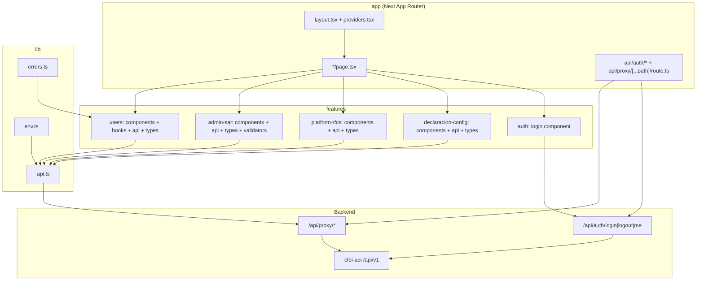
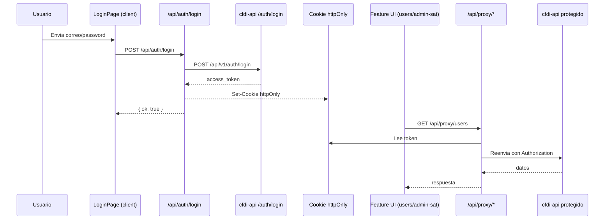

# Arquitectura de cfdi-admin-ui

Frontend Next.js (App Router) con enfoque **BFF + modulos por feature**.

## Que significa BFF + modulos por feature

### BFF (Backend for Frontend)
Es una capa backend ligera dentro del mismo frontend (aqui, API routes de Next en `app/api/*`) que:
- recibe requests del navegador,
- maneja autenticacion (cookie httpOnly con JWT),
- reenvia llamadas al backend real (`cfdi-api`),
- oculta detalles sensibles al cliente (token y URL interna del API).

En este proyecto, el BFF vive en:
- `app/api/auth/login/route.ts`
- `app/api/auth/logout/route.ts`
- `app/api/auth/me/route.ts`
- `app/api/proxy/[...path]/route.ts`

### Modulos por feature
La app se organiza por dominio funcional, no por tipo tecnico global.
Cada feature agrupa su UI, su API y sus tipos:
- `features/users/*`
- `features/admin-sat/*`
- `features/platform-rfcs/*`
- `features/declaracion-config/*`
- `features/auth/*`

Beneficios:
- menor acoplamiento entre modulos,
- cambios localizados por negocio,
- escalado mas simple por equipo o por funcionalidad.

## Estructura principal
- `app/`: rutas y layouts de Next (UI routing + API routes BFF).
- `features/`: componentes, hooks, APIs y tipos por modulo funcional.
- `lib/`: utilidades compartidas (`env`, `api`, `errors`).
- `components/`: componentes UI reutilizables.

## Diagrama de capas (BFF)

## Diagrama tecnico por componentes

## Secuencia real: login + llamadas autenticadas

## Referencias clave
- `app/providers.tsx` (React Query provider)
- `app/api/auth/login/route.ts`
- `app/api/auth/logout/route.ts`
- `app/api/auth/me/route.ts`
- `app/api/proxy/[...path]/route.ts`
- `proxy.ts` (proteccion de rutas privadas)
- `features/users/hooks/use-users.ts`
- `features/users/api.ts`
- `lib/api.ts`
- `lib/env.ts`

## Endurecimiento aplicado (Sprint 1)
- Middleware (`proxy.ts`) protege rutas privadas:
  - `/users/*`
  - `/admin-sat/*`
  - `/platform-rfcs/*`
  - `/declaracion-config/*`
  - `/rfc-users/*`
- El cliente ya no inyecta token via variable publica (`NEXT_PUBLIC_API_TOKEN`).
- La autenticacion de usuario queda centralizada en cookie httpOnly + BFF (`/api/auth/*` y `/api/proxy/*`).
