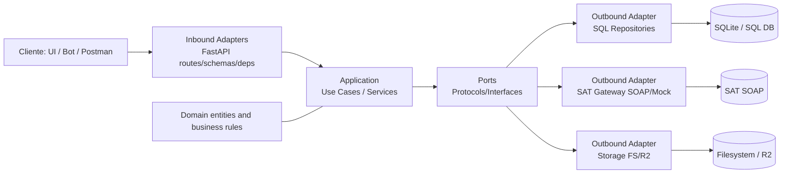
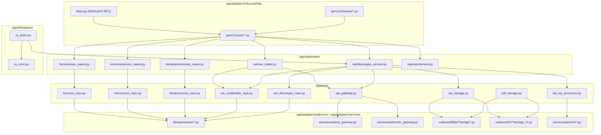
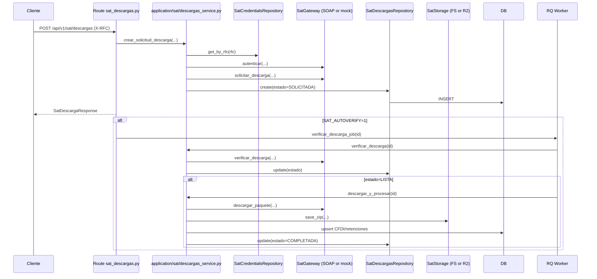

# Arquitectura de cfdi-api

Backend Python (FastAPI) con arquitectura hexagonal ligera (ports and adapters).

## Contextos principales
- Facturas: CFDI emitidos/recibidos, conceptos y pagos.
- Retenciones: XML de retenciones de plataformas.
- Declaraciones: PDFs de declaraciones mensuales y su resumen.
- Reportes: resumen mensual, modo declaracion y hoja SAT.
- SAT: credenciales, autenticacion, solicitud/verificacion/descarga de paquetes.

## Capas y responsabilidades
- Domain (`app/domain`): entidades y reglas puras del negocio.
- Application (`app/application`): casos de uso/servicios que orquestan flujo.
- Ports (`app/ports`): contratos (interfaces/protocols) que usa application.
- Inbound adapters (`app/adapters/inbound`): entrada HTTP (FastAPI routes/schemas/deps).
- Outbound adapters (`app/adapters/outbound` y `app/adapters/services`): DB, storage FS/R2, SAT SOAP/mock, parsers.
- Infra (`app/infra`): ejecucion de jobs RQ y conexion de cola.

## Reglas de dependencia
- Core (domain + application) no depende de FastAPI, SQLAlchemy ni filesystem.
- Application depende de ports (abstracciones), no de implementaciones concretas.
- Adapters implementan ports y pueden depender de frameworks/librerias externas.
- Direccion esperada: `inbound -> application -> ports -> outbound`.

## Diagrama de capas

## Diagrama tecnico por componentes

## Flujo tecnico SAT (secuencia real)

## SAT: puertos y adapters
### Puertos
- `SatCredentialsRepository`: persistencia de credenciales SAT.
- `SatCrypto`: cifrado/descifrado de PFX y password.
- `SatGateway`: autenticar, solicitar/verificar/descargar paquetes SAT.
- `SatStorage`: persistencia y lectura de ZIP descargados.
- `SatZipProcessor`: procesamiento de ZIPs SAT (parsear XML e importar CFDI/retenciones).

### Implementaciones
- `adapters/outbound/db/repositories/sat_credentials.py` -> `SatCredentialsRepository`.
- `adapters/outbound/db/repositories/sat_descargas.py` -> `SatDescargasRepository`.
- `adapters/services/sat/crypto/*` -> `SatCrypto` (Fernet).
- `adapters/services/sat/sat_gateway.py` -> `SatGateway` SOAP.
- `adapters/services/sat/mock_gateway.py` -> `SatGateway` mock para pruebas.
- `adapters/outbound/files/sat_storage_fs.py` y `adapters/outbound/r2/sat_storage_r2.py` -> `SatStorage`.
- `adapters/services/parsers/sat_zip_processor.py` -> `SatZipProcessor`.
- `adapters/services/sat/soap/*`, `wsse/*`, `pkcs12/*` encapsulan detalles tecnicos SAT.

## Ensamblado de la app
- `app/main.py` crea la app FastAPI.
- Incluye router API con prefijo `/api/v1`.
- Inicializa metadatos SQLAlchemy al arranque (`Base.metadata.create_all`).
- Cierra engine al apagar.

## Nota de actualizacion
Documento validado contra la estructura de codigo actual:
- `app/main.py`
- `app/adapters/inbound/http/api/v1/routes/__init__.py`
- `app/application/sat/descargas_service.py`
- `app/ports/sat_gateway.py`
- `app/infra/queue/rq_tasks.py`
