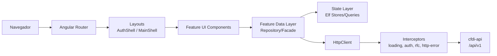
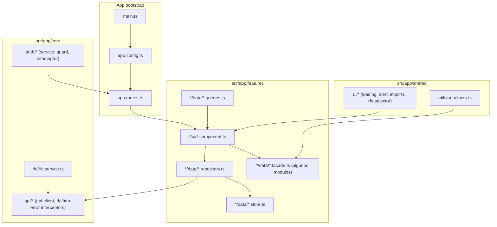
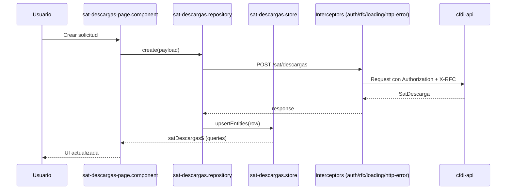

# Arquitectura de cfdi-ui

Frontend Angular (standalone components) con arquitectura modular por `core`, `features`, `shared` y `layouts`.

## Capas y responsabilidades
- `core`: infraestructura transversal (auth, API base, interceptors, RFC).
- `features`: modulos de negocio (facturas, retenciones, declaraciones, sat-descargas, etc.).
- `shared`: componentes/servicios reutilizables de UI (alerts, loading, imports, helpers).
- `layouts`: shells de navegacion (`AuthShellComponent` y `MainShellComponent`).

## Ensamblado de la app
- `src/main.ts`: bootstrap de la aplicacion standalone.
- `src/app/app.config.ts`: providers globales (router, HttpClient, interceptors, animations).
- `src/app/app.routes.ts`: rutas lazy por feature y guards de autenticacion.

## Diagrama de capas

## Diagrama tecnico por carpetas

## Flujo tecnico de una pantalla (ejemplo: sat-descargas)

## Notas de diseno actuales
- Estado global por feature con `@ngneat/elf`.
- Carga de modulos por `loadComponent` (lazy) en rutas.
- Base URL de backend via `environment.apiBaseUrl` (default `/api/v1`).
- Guard de autenticacion configurable con `authEnabled`.
- Validacion de sesion configurable con `authValidationMode` (`local` o `server`).

## Referencias clave en el codigo
- `src/main.ts`
- `src/app/app.config.ts`
- `src/app/app.routes.ts`
- `src/app/core/auth/auth.service.ts`
- `src/app/core/auth/auth.guard.ts`
- `src/app/core/api/rfc.interceptor.ts`
- `src/app/features/facturas/data/facturas.repository.ts`
- `src/app/features/sat-descargas/data/sat-descargas.repository.ts`
